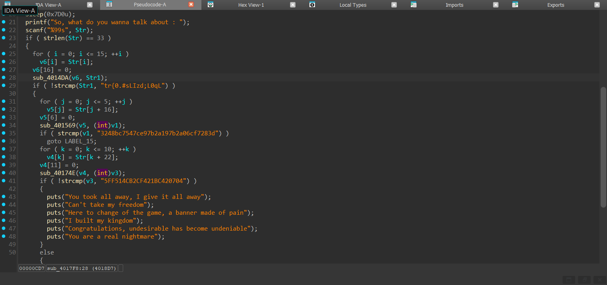

# American Nightmare Writeup
**Description:**
To be or not to be - will you make the undesirable undeniable?

**Attachment:**
[American Nigthmare](../Files/American%20Nightmare.exe)

## Solution

We start by running the command `file` to know the type of our file:

    American Nightmare.exe: PE32 executable (console) Intel 80386 (stripped to external PDB), for MS Windows, 8 sections

It is a portable executable.

So, we use `IDA` to decompile our file:



As we can see, the program checks if the length of our input is 33 then it takes 16 characters from our input then passed to `sub_4014DA` and after analysing this function it turns out that it is an affine cipher encryption with a=63 and  b=65 and it checks that the encrypted affine cipher is equal to "tr{0.#sLIzd;L0qL".

After that, the program takes 6 characters after the 1st part and passed to a function `sub_401569` and it turns out that this function is to compute MD5 hash and checks if the hash of this part is equal to "3248bc7547ce97b2a197b2a06cf7283d" which corresponds to "finish".

After that, the program takes the remaining characters and passed to `sub_40174E` and This function encodes a string into a hex string where: 
The first byte is the ASCII value of the first character.
Each subsequent byte is the difference between the current and previous character.
This is a form of "delta encoding" in hexadecimal.

Now we can write our python solver:

```py
def encode1(c):
    return chr((63 * (ord(c) - 32) + 65) % 95 + 32)

def decode1(target):
    res = ""
    for t in target:
        for x in range(32, 127):
            if encode1(chr(x)) == t:
                res += chr(x)
                break
    return res

def decode3(hexstr):
    chars = []
    for i in range(0, len(hexstr), 2):
        val = int(hexstr[i:i+2], 16)
        if i == 0:
            chars.append(val)
        else:
            chars.append((val + chars[-1]) & 0xFF)
    return ''.join(chr(c) for c in chars)

# Given values
target1 = "tr{0.#sLIzd;L0qL"
target3 = "5FF514CB2CF421BC420704"
part2 = "finish"

# Decode
part1 = decode1(target1)
part3 = decode3(target3)

# Assemble flag
flag = part1 + part2 + part3
print("Flag:", flag)
```

After running our solver we get our flag:

    FL1TZ{I_h4v3_TO_finish_Th3_St0ry}

Just like the American Nightmare, I also have to finish the story <3 <3.

***Author: OTC***