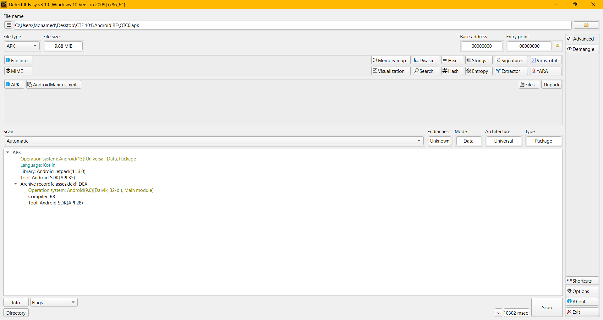
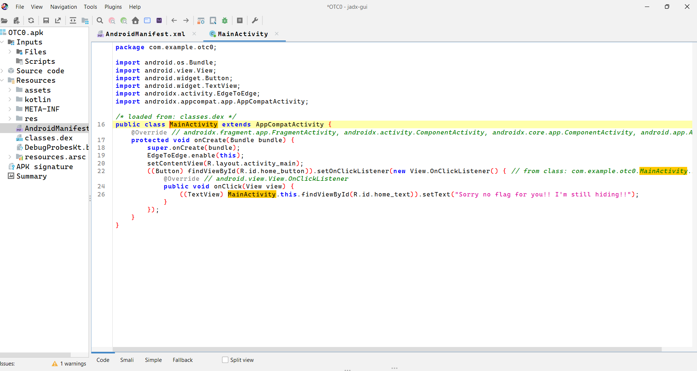
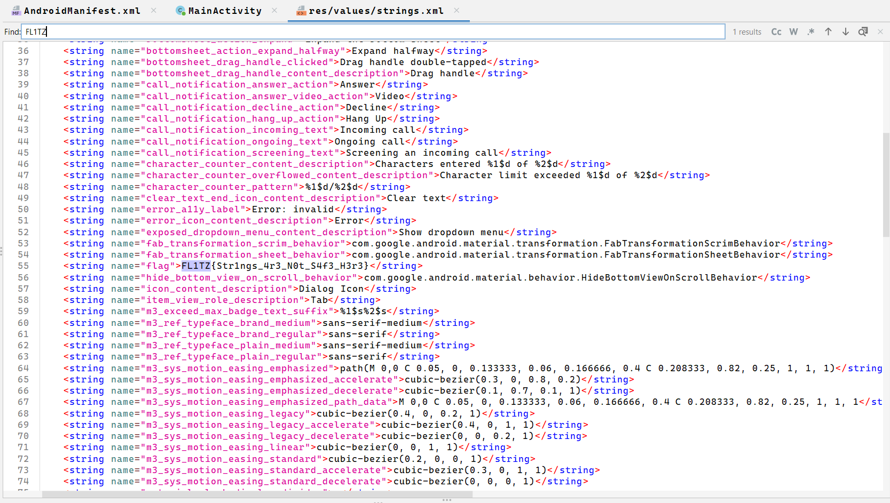

# Android RE Writeup
**Description:**
Somewhere deep inside its code or resources, a secret message is hidden.

**Attachment:**
[OTC0](../Files/OTC0.apk)

## Solution

We start by using `Detect it Easy` aka `DIE` to know the type of our file:

As we can see, it is an apk file.

So in this case, we will use `JADX` to decompile our file.

**Understanding Android Reverse Engineering**

---

## **Why is it easy to reverse engineer an APK?**

### 1. **APK is Just a Zip File**
- An APK (Android Package) is basically a ZIP archive.
- You can open it with any unzip tool and see its contents (classes, resources, assets, etc.).

### 2. **Java Bytecode is High-Level**
- Android apps are usually written in Java or Kotlin, which compile to **bytecode** (DEX format).
- Bytecode retains a lot of structure and information from the original source code (class names, method names, etc.).

### 3. **Powerful Decompilers Exist**
- Tools like **Jadx**, **JD-GUI**, and **FernFlower** can convert DEX bytecode back into readable Java code.
- The decompiled code is often very close to the original, making it easy to understand the app’s logic.

### 4. **Lack of Obfuscation**
- Many apps are **not obfuscated** (or only lightly obfuscated), so variable and function names are still meaningful.
- Even with obfuscation, tools can often still recover the logic, just with less readable names.

### 5. **No Native Compilation**
- Unlike C/C++ (which compiles to native machine code), Java/Kotlin code in APKs is not fully compiled to native code, making it easier to reverse.

### 6. **Resources are Exposed**
- Images, layouts, and even some configuration files are stored in the APK in readable formats (XML, PNG, etc.).

**What is an activity in android**

An Activity is a core component in Android apps.
It represents a single screen with a user interface (UI).
Each screen (login, home, settings, etc.) is usually an Activity.
Activities have a lifecycle (created, started, resumed, paused, stopped, destroyed) managed by the Android OS.

After analysing our apk, it is clear that it has a only one activity which is the MainActivity. This is the decompilation of the main activity our apk file:

After some observation of the java code, it turns out that the main activity shows a button when pressed it will show "Sorry no flag for you!! I'm still hiding!!" so I guess we should try another approach to find the flag.

After heading to the file /res/values/strings.xml and searching for the flag by CTRL+F and typing "FL1TZ" this is what it will show:

And finally we have found our flag:

    FL1TZ{Str1ngs_4r3_N0t_S4f3_H3r3}

***Author: OTC***