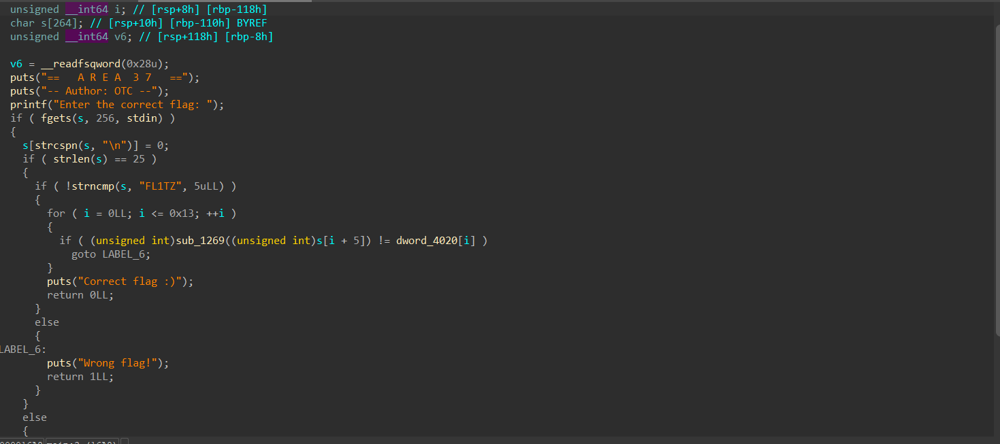

# Area 37 Writeup
**Description:**
Dive into the depth of area 37, can you make it out alive.


**Attachment:**
[37](../Files/37)

## Solution

We start by running the command `file` to know the type of our file:

    37: ELF 64-bit LSB pie executable, x86-64, version 1 (SYSV), dynamically linked, interpreter /lib64/ld-linux-x86-64.so.2, BuildID[sha1]=6a60eaa1a5cfead21b13d53ee7138f0aecc09129, for GNU/Linux 3.2.0, stripped

It is a linux executable.

We use `IDA` to decompile our binary:



As we can see, it turns out that our program checks first if the length of our input is 37 then it checks that if it starts with "FL1TZ" and encrypt each character after "FL1TZ" with an encryption method with a function named `sub_1269` and compares it to an array named `dword_4020`.

After analysing this function it turns out that it multiplies the ascii of each character with 37 then reverses the number and add 0s in between digits then divides by 37.

Now we understand how the program encrypts each character all we have to do is to import the array of the encrypted flag and write our solver:
```python
    def decrypt(encrypted):
    if (encrypted == 1892):
        return 110
    # Multiply the encrypted number by 37 to reverse the division
    encrypted *= 37
    
    # Convert the number to a string
    encrypted_str = str(encrypted)
    
    # Remove the 0s at odd indices
    decrypted_str = ''.join([char for i, char in enumerate(encrypted_str) if i % 2 == 0 or char != '0'])
    
    # Reverse the string to get the original reversed number
    reversed_str = decrypted_str[::-1]
    
    # Convert the reversed string back to an integer
    decrypted = int(reversed_str)
    
    # Divide by 37 to get the original number
    original = decrypted // 37
    
    return original

    v = [28392,191373,135946,135419,81373,136492,135419,109192,216492,81373,81892,191373,135419,164346,243792,81892,162719,191373,216492,135692]
    print("FL1TZ",end='')
    for x in v:
        print(chr(decrypt(x)), end='')
```
After running our solver it will output the flag:

    FL1TZ{37_1s_pr1m3_Numb3r}

***Author: OTC***