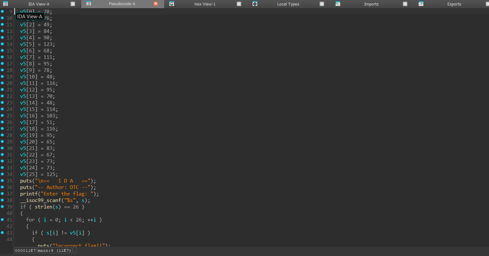

# IDA Writeup
**Description:**
Come on it is very easy-peasy!!

**Attachment:**
[IDA](../Files/IDA)

## Solution

We start by running the command `file` to know the type of our file:

    IDA: ELF 64-bit LSB pie executable, x86-64, version 1 (SYSV), dynamically linked, interpreter /lib64/ld-linux-x86-64.so.2, BuildID[sha1]=a543f6aaee4d885fe928d7a3171dce87f66cd362, for GNU/Linux 3.2.0, not stripped

We notice that our file is a linux executable.

The name of the task is `IDA` so we have to use it to find our flag.

After decompiling the program with IDA we got:



First the program checks if our input has 26 length then it checks character by character if it is equal to v5.

Now we can write our solver:
```py
    v5 = [
    70, 76, 49, 84, 90, 123, 68, 111, 95, 78, 48, 116, 95,
    70, 48, 114, 103, 51, 116, 95, 65, 83, 67, 73, 73, 125
    ]

    flag = ''.join(chr(x) for x in v5)
    print("Flag:", flag)
```
We run our script and we get our flag:

    FL1TZ{Do_N0t_F0rg3t_ASCII}

***Author: OTC***
