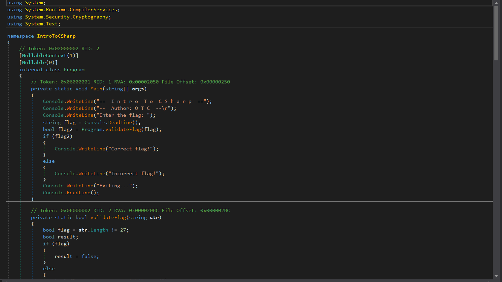
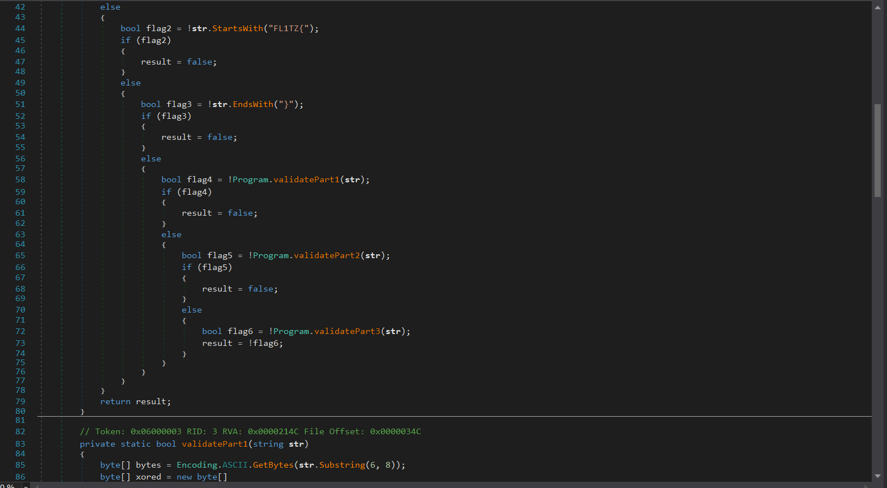
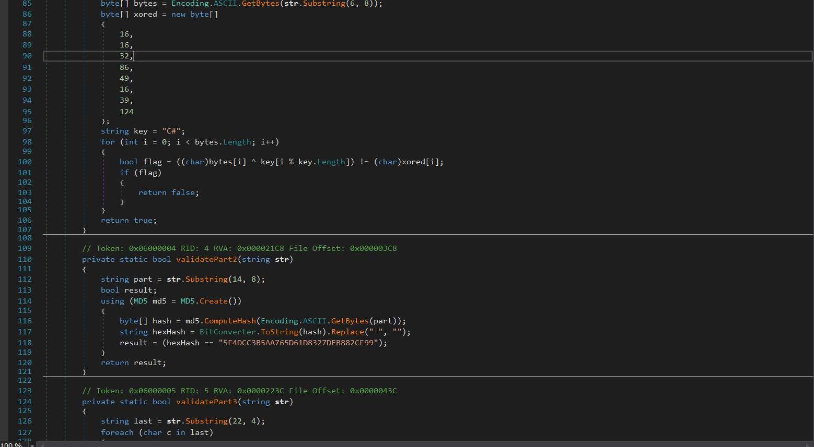
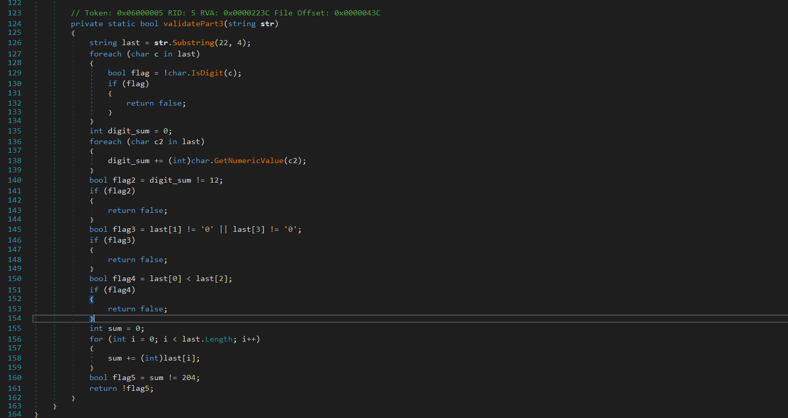

# Intro To CSharp Writeup
**Description:**
Learn about reverse engineering of C#

**Attachment:**
[My app](../Files/MyApp.zip)

## Solution:
**Understanding C#**

C# doesn’t compile directly to machine code like C/C++. Instead, it compiles to CIL (Common Intermediate Language), which is a high-level, human-readable bytecode used by the .NET runtime.

This IL retains a lot of high-level information, such as:

1. Method names

2. Class structures

3. Property names

4. Even variable names (unless obfuscated)

We unzip our file then We use a tool named `dnSpy` to decompile `MyAPP.dll` file:









After analysing our code we can assume that:

1. The program checks if the input has a lentgh of 27.

2. The program checks if the input starts with "FL1TZ{" and ends with "}"

3. The program extracts the first part which is the 8 characters after the character "{" and makes the xor operation with the key="C#" and checks if the bytes of the encrypted part is equal to the array "xored"

4. The program extracts the 2nd part which is the 8 first characters after the 1st part and checks if the md5 hash is equal to "5F4DCC3B5AA765D61D8327DEB882CF99". Keep in mind that the hash is not reversible but there is a list of md5 hashes that matches strings, this hash matches the word "password", you can also use `CrackStation` to extract this md5 hash.

5. The program extracts the 4 characters before "}" and checks if it contains only digits, the sum of the digits is 12, the 2nd digit and the last digit is 0, the 1st digit must be greater to the 3rd digit and finally the ascii sum is equal to 204.

Now we can write our solver:
```py
import hashlib

def validate_part1():
    xored = [16, 16, 32, 86, 49, 16, 39, 124]
    key = "C#"
    part = ""

    for i in range(8):
        c = xored[i] ^ ord(key[i % len(key)])
        part += chr(c)
    return part


def validate_part2(part):
    # MD5 hash of the part must be "5F4DCC3B5AA765D61D8327DEB882CF99" (uppercase)
    h = hashlib.md5(part.encode('ascii')).hexdigest().upper()
    return h == "5F4DCC3B5AA765D61D8327DEB882CF99"

def validate_part3(part):
    # Must be 4 digits only.
    if len(part) != 4 or not part.isdigit():
        return False
    # Sum of digits must equal 12.
    if sum(int(c) for c in part) != 12:
        return False
    # The 2nd and 4th characters must be '0'
    if part[1] != '0' or part[3] != '0':
        return False
    # The first digit must be greater than or equal to the third.
    if int(part[0]) < int(part[2]):
        return False
    # Sum of ASCII values of the 4 digits must equal 204.
    ascii_sum = sum(ord(c) for c in part)
    if ascii_sum != 204:
        return False
    return True

def find_flags():
    prefix = "FL1TZ{"
    suffix = "}"
    # Fixed parts derived from reverse engineering:
    part1 = validate_part1()
    part2 = "password"
    
    valid_flags = []
    
    for d0 in range(10):
        for d2 in range(10):
            d1 = 0
            d3 = 0
            # Check sum condition: d0 + d1 + d2 + d3 == 12
            if d0 + d1 + d2 + d3 != 12:
                continue
            if d0 < d2:
                continue
            part3 = f"{d0}{d1}{d2}{d3}"
            if sum(ord(c) for c in part3) != 204:
                continue
            if validate_part3(part3):
                flag = prefix + part1 + part2 + part3 + suffix
                valid_flags.append(flag)
    return valid_flags

if __name__ == "__main__":
        flags = find_flags()
        print("Valid flag(s) found:")
        for flag in flags:
            print(flag)
```
After running our solver we got the flag:

    FL1TZ{S3cur3d_password6060}
    FL1TZ{S3cur3d_password7050}
    FL1TZ{S3cur3d_password8040}
    FL1TZ{S3cur3d_password9030}

***Author: OTC***
