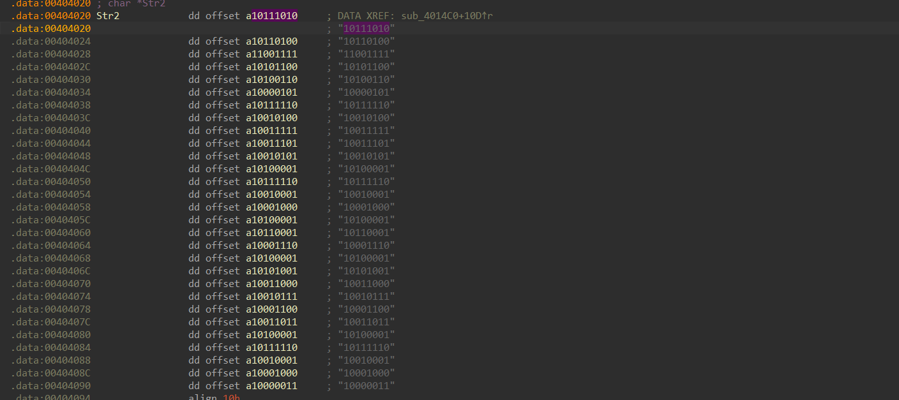

# White Box Writeup
**Description:**
They say think outside the "BOX", maybe what’s inside is just negative space.

**Attachment:**
[White Box](../Files/White%20Box.exe)

## Solution

We start by running the command `file` to know the type of our file:

    White Box.exe: PE32 executable (console) Intel 80386 (stripped to external PDB), for MS Windows, 8 sections

It is a Windows portable executable.

**Understanding the Black Box concept**

The **black box** concept in reverse engineering refers to analyzing a system **without access to its internal code or design**—treating it like a “black box” where you can only observe **inputs and outputs**.

We use IDA to decompile this executable and we will focus on the function `sub_4014C0` especially strcmp function at the end.

We notice that our input Str1 has passed through some modifications and compared with an array Str2.

Since we handle a black box challenge and we know our flag format which is FL1TZ{}, let's try for example comparing the 1st character F with the first element of the array.
We also notice that this array is in binary string.

F-->01000110 | Str2[0]-->10111010

In fact, we notice that each character of the flag is being transformed to the **2's complement**.

Each time onverting a signed binary value back to its original decimal form we construct our flag and we get:

    FL1TZ{Black_Box_Or_White_Box}

***Author: OTC***