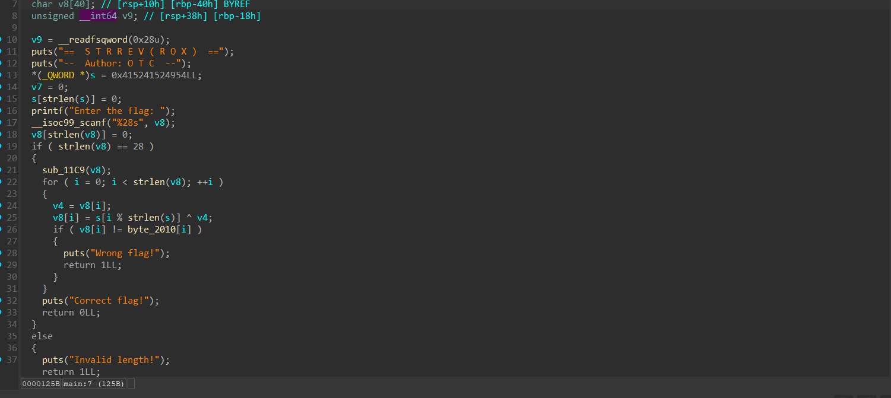
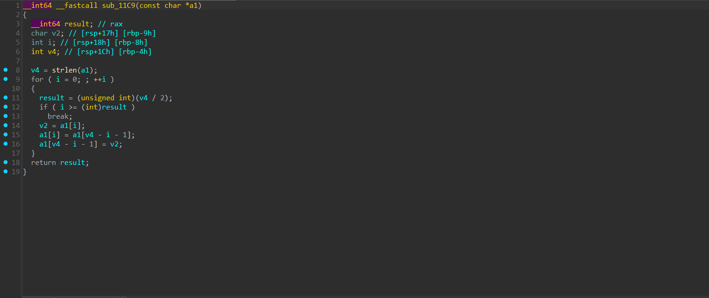
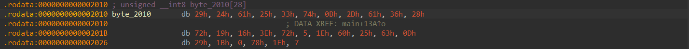

# strrev(rox) Writeup
**Description:**

Someone named R-0X has encrypted my hidden message can u retrieve it for me ??

**Attachment:**
[strrev(rox)](../Files/strrev(rox))

## Solution

We start by running the command `file` to know the type of our file:

    strrev(rox): ELF 64-bit LSB pie executable, x86-64, version 1 (SYSV), dynamically linked, interpreter /lib64/ld-linux-x86-64.so.2, BuildID[sha1]=334ccca9d6427a789a0195142152a63f5e98c0af, for GNU/Linux 3.2.0, stripped

We notice that our file is a linux executable.

**Understanding the title**

`strrev` is C function that reverse a string.
When we apply it to rox it gives us "xor"

So we can notice that our challenge is related to XOR encryption and reversing a string.

We use `IDA` to decompile our binary:



We notice that our program checks first if the length of the input is 28.

Then, after decompiling the `sub_11C9` function and analysing it we notice that is reverses our input:



After that, it makes xor encryption with the key s which is in little endian after converting the bytes to ascii we notice that our key is s="TIRARA"

After the xor encryption it checks if each byte of our input is equal to each byte of the array `byte_2010`. We have to find the bytes of this array so we can be able to write our solver. Thanks to IDA we can find the bytes of this array by clicking it:



Now we can write our solver:
```py
    encrypted = [
    0x29, 0x24, 0x61, 0x25, 0x33, 0x74,
    0x0B, 0x2D, 0x61, 0x36, 0x28, 0x72,
    0x19, 0x16, 0x3E, 0x72, 0x05, 0x1E,
    0x60, 0x25, 0x63, 0x0D, 0x29, 0x1B,
    0x00, 0x78, 0x1E, 0x07
    ]

    key = [0x54, 0x49, 0x52, 0x41, 0x52, 0x41]

    reversed_flag = []
    for i in range(len(encrypted)):
        k = key[i % len(key)]
        c = encrypted[i] ^ k
        reversed_flag.append(c)

    flag = bytes(reversed(reversed_flag))

    print("Flag:", flag.decode())
```
After running our solver we got:

    FL1TZ{L1l4_W3l_M3zw3d_5ad3m}

***Author: OTC***