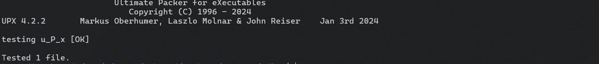

# u_P_x Writeup
**Description:**

I heard someone mentions about packer.

**Attachment:**
[u_P_x](../Files/u_P_x)

## Solution

We start by running the command `file` to know the type of our file:

    u_P_x: ELF 64-bit LSB pie executable, x86-64, version 1 (SYSV), statically linked, no section header

We notice that our file is a linux executable.

The name of the challenge is interesting, right?!
In fact `UPX` is a free, secure, portable, extendable, high-performance executable packer for several executable formats.

You can download `UPX` using the command:
    
    sudo apt install upx

We test if our file is packed with UPX:
    
    upx -t u_P_x

It will give us this:

This is a proof that our file is packed with upx.

We unpack our file with upx:
    
    upx -d u_P_x

We run our program:

    ==   u _ P _ x   ==
    -- Author: OTC --
    Enter the secret 7ibiya password:

We notice that our program requires an input to give us the flag.

We use the command `ltrace`:

    ltrace ./u_P_x

When we give our program an input for example "ssss" it shows somting interesting:
    
    strcmp("ssss", "WeLcoMe_7iBiYa")                                          = 28

In fact `strcmp` is a C function that returns 0 if two strings are equal.

So all we have to do is typing "WeLcoMe_7iBiYa"

    ==   u _ P _ x   ==
    -- Author: OTC --
    Enter the secret 7ibiya password: WeLcoMe_7iBiYa
    7ibiya menek!
    Hez flag mta3ek: FL1TZ{UPX_1s_V3ry_3asy!!}

Finally we got our flag:
    
    FL1TZ{UPX_1s_V3ry_3asy!!}

***Author: OTC***